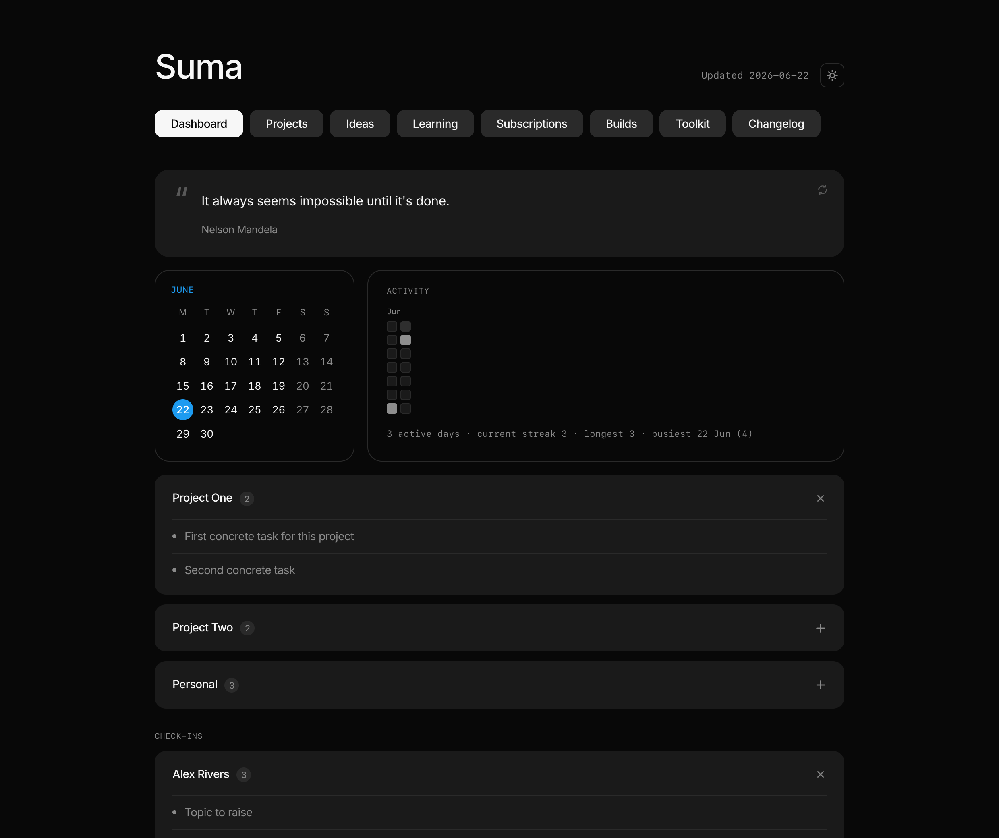

# Suma Starter



A starter kit for a personal dashboard system called **Suma**. Hand this folder to an AI coding agent (Claude Code, Cursor, etc.) and ask it to set up Suma for you.

Suma is markdown-in, HTML-out. You edit a handful of `.md` files in a "vault" folder, run one script, and get a clean single-page dashboard you double-click to open. No server. No app. No database. No `pip install`.

It was originally built by Ilya as part of a wider personal knowledge vault. This starter strips it down to just the dashboard layer so anyone can adopt it.

---

## What's in this folder

```
suma-starter/
├── README.md          ← you are here
├── SETUP.md           ← step-by-step for the agent installing this
├── CLAUDE.md          ← rules the agent should follow while working in your vault
├── DESIGN.md          ← visual / UX conventions baked into the renderer
├── build.py           ← stdlib-only renderer (markdown → dashboard.html)
└── sources/           ← templates for the markdown files you'll edit day-to-day
    ├── dashboard.md
    ├── projects.md
    ├── ideas.md
    ├── learning.md
    ├── subscriptions.md
    ├── changelog.md
    ├── quotes.md       ← starter quotes for the daily quote (optional)
    └── people/         ← example People notes (drive "Birthdays this month"); copy to vault/People/
```

`builds.md` and `toolkit.md` are **auto-generated** by `build.py` (from your code folder and your coding-agent setup) — don't write them by hand.

---

## What Suma actually is

Suma is one HTML page with eight tabs:

1. **Dashboard** — a daily quote up top, a calendar + activity-heatmap widget row, then "Now" (project-grouped checkbox to-dos as cards), "Check-ins" (one card per person you sync with), and "Birthdays this month"
2. **Projects** — Overview (~5 portfolio bullets) + Active (Building / Advising) + Idle / Resumable. One line per project: status + "Next:" clause.
3. **Ideas** — Sketched, not built. Promote into Projects when one earns the time.
4. **Learning** — Currently reading / Books / Watch / Leisure / Articles / Tools / Design refs / People / Bookmarks. An inventory, not tasks.
5. **Subscriptions** — Recurring subscriptions, renewal dates, and which card pays for each. See your run-rate at a glance.
6. **Builds** — Auto-scanned list of code projects on your machine, grouped by deploy status (live / on git / local only).
7. **Toolkit** — Auto-scanned list of what's wired into your coding agent: MCP servers, skills, plugins, slash-commands and CLIs. The stuff that's installed but otherwise invisible. Fills itself in; shows a quiet empty state if you have none.
8. **Changelog** — A running log of what changed in the vault. Newest day first, one line per change.

Most tabs map to one source file in `sources/`. Builds and Toolkit have no source — they scan your machine on each rebuild. The whole point is that you write plain markdown and the dashboard renders itself.

---

## How it works

Suma is just one folder in your vault. The markdown sources and the renderer live together, and the dashboard is generated right alongside them.

1. You keep a folder of markdown files somewhere on disk (your "vault").
2. Inside it, a `Suma/` folder holds the source `.md` files **and** `build.py`.
3. Run `python3 build.py`. It reads the `.md` files next to it and writes `dashboard.html` in the same folder.
4. Double-click `dashboard.html` to view it. No server needed.

```
your-vault/
├── People/               ← optional: notes with a `**Birthday:** Month Day` line
│   └── ...                  feed "Birthdays this month" on the Dashboard
└── Suma/
    ├── build.py          ← the renderer
    ├── dashboard.md
    ├── projects.md
    ├── ideas.md
    ├── learning.md
    ├── subscriptions.md
    ├── changelog.md
    ├── quotes.md
    └── dashboard.html     ← generated, you open this
```

No separate code folder, no sibling paths, no config to edit. Drop the kit's `build.py` and `sources/*.md` into `Suma/`, run it, open the dashboard. People notes are optional and live one level up in `vault/People/`; without them the birthdays list just stays hidden.

---

## Conventions worth keeping

These are load-bearing — break them and the dashboard reads worse over time, not better.

- **One source of truth.** Tasks go in `dashboard.md` (Now). Project state goes in `projects.md`. Don't duplicate.
- **One line per project on the dashboard.** Detail goes inside the actual project's notes, not Suma.
- **Now is project-grouped checkboxes.** `### Project Name` headers, then `- [ ] thing` bullets. Toggle by editing the file.
- **Check-ins are plural recurring agendas, not tasks.** Use plain bullets, not checkboxes — they don't "complete".
- **Plain language in Suma entries.** Write like a teammate summary, not a commit log. No file paths, env vars, component names in changelog bullets — that detail belongs inside project notes.
- **YYYY-MM-DD dates everywhere.** Sortable, unambiguous.
- **kebab-case filenames.** No spaces, no underscores, no capitals. `README.md` and `CLAUDE.md` are the only exceptions.
- **Newest entry first** in changelog. Each day gets one `## YYYY-MM-DD` heading at the top.
- **Suma stays visually calm.** No status strips, no coloured "Focus" blocks, no KPI tiles. Quiet text + whitespace IS the design.

---

## Next steps for your agent

Open `SETUP.md` and follow it. It walks through:

1. Picking where the vault lives
2. Setting up the folder structure
3. Copying `build.py` into place
4. Filling in your first real content
5. Running the build and opening the dashboard

After setup, `CLAUDE.md` and `DESIGN.md` are the rules the agent should follow on every future Suma edit.

---

## Credits

System designed and built by **Ilya** ([ilyyya.com](https://www.ilyyya.com/)). Shared as a starter for anyone who wants the same dashboard for their own work.
